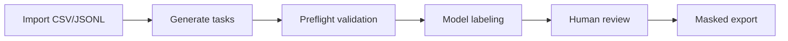

# Annotation Pipeline Guide

## System Overview

AP is an exchange-level annotation pipeline. One imported row represents one exchange; AP groups exchanges by `session_id`, sorts them by `exchange_time`, labels them with an OpenAI-compatible model endpoint, supports human review, and exports masked results.



Stable internal fields:

- `task_id`: AP task key, derived from `exchange_id` for exchange tasks and from `session_id` for session tasks.
- `turns`: the labeling object.
- `status`: `pending`, `labeled`, `reviewed`, `exported`, or `failed`.
- `payload`: business and reference fields.

## Import Contract

Configure source columns in `config/import_mapping.yaml`.

```yaml
import_mapping:
  source_format: csv
  task_mode: turn_with_context
  fields:
    session_id: "session_id"
    exchange_id: "exchange_id"
    exchange_time: "exchange_time"
    turns: "turns"
  reference_fields:
    next_user_query: true
  passthrough:
    - "user_id"
    - "channel"
```

Required fields:

- `fields.session_id`: one complete multi-turn session.
- `fields.exchange_id`: one exchange ID; used for idempotent task creation.
- `fields.exchange_time`: exchange-level ordering time inside a session.
- `fields.turns`: one exchange, usually user question plus assistant answer. It may contain only a user message if the assistant did not reply.

`turns` may be JSON:

```json
[
  {"role": "user", "content": "I want to return this order."},
  {"role": "assistant", "content": "Please provide the order number."}
]
```

`passthrough` fields are copied into `payload`. Python code must not hard-code business column names.

`reference_fields.next_user_query: true` asks AP to derive `payload.next_user_query` for
`turn_with_context` tasks. AP sorts each `session_id` by `exchange_time`, stores the next
exchange's first user message on the current task, and stores an empty string on the final
exchange. Tasks can expose this reference through `prompt_vars` while hiding it from the
regular `{payload}` prompt block:

```yaml
prompt_vars:
  next_user_query:
    source: payload.next_user_query
    default: ""
    hide_from_payload: true
```

`turn_mode` is no longer supported. Use `task_mode`.

## Task Modes

- `turn_with_context` is the default. The current exchange is labeled, and earlier exchanges in the same session are stored in `payload.context_turns`.
- `turn_only` labels only the current exchange.
- `session` labels the full session. All exchanges in the same session are sorted by `exchange_time` and merged into `turns`.

AP groups by `session_id` and sorts by `exchange_time`. It does not split raw single messages into exchanges; upstream systems can keep their own exchange definition logic.

## Model Configuration

`config/config.yaml` keeps endpoint, key, model, timeout, sampling, and thinking mode.

```yaml
model:
  endpoint: ${OPENCLAW_ENDPOINT}
  api_key: ${OPENCLAW_API_KEY}
  name: "openclaw-model"
  timeout: 120
  temperature: 0
  top_p: 1
  seed: null
  thinking:
    enabled: false
```

When thinking mode is enabled, AP sends:

```json
{"thinking": {"type": "enabled"}}
```

and omits `temperature`, `top_p`, and `seed`.

`reasoning_content` is not stored in annotation or export.

## Preflight

Run preflight before large batches:

```bash
python cli.py preflight --sample 1 --strict
```

Preflight calls the real model on a small sample, then validates JSON, schema, and enum values without writing batch labels. If the response contains usage cache fields, AP reports them as evidence only; cache warmup is best-effort.

## Output Schema and Quality Gates

Task schemas live under `config/tasks/`.

```yaml
output_schema:
  role_level:
    type: string
    enum:
      - L6级参谋
      - L5级顾问
```

AP validates:

- all schema fields are present
- no unexpected fields are returned
- field types match
- enum values match exactly when configured

For example, `L6级` does not pass an enum requiring `L6级参谋`.

## Review and Export

Start the workspace:

```bash
python cli.py serve --open
```

The review page supports status filters, annotation value filters, editable annotation JSON, review notes, retrying failed labels, and export.

Annotation preview fields are clickable. Clicking a field appends a field-specific review note such as:

```text
role_level: L6级参谋 - 
```

Export reviewed cases:

```bash
python cli.py export --out exports
```

Exports always pass through masking when `export.masking` is true.

### Persistent Linux VM service

For long-running Linux VM use, prefer systemd over a Python self-daemon:

```bash
sudo cp deploy/ap-review.service.example /etc/systemd/system/ap-review.service
sudo cp deploy/annotation-pipeline.env.example /etc/annotation-pipeline.env
sudo editor /etc/systemd/system/ap-review.service
sudo editor /etc/annotation-pipeline.env
sudo systemctl daemon-reload
sudo systemctl enable ap-review
sudo systemctl start ap-review
sudo systemctl status ap-review
journalctl -u ap-review -f
```

The template assumes `/opt/annotation-pipeline` and `.venv/bin/python`; edit `WorkingDirectory`
and `ExecStart` for your VM path. Without root access, use `tmux` for interactive persistence.
`setsid` is acceptable for short-lived work, but it will not restart a crashed service.

## Reliability Reports

Reliability reports compare two annotation runs or predictions against a gold set without writing
to the database:

```bash
python cli.py reliability --run-a data/run_a.jsonl --run-b data/run_b.jsonl --task intent_v1 --out reports/reliability
python cli.py reliability --pred data/model.jsonl --gold data/gold.jsonl --mode gold_eval --task intent_v1 --out reports/gold_eval
python cli.py reliability --input data/annotations.csv --task intent_v1 --out reports/reliability
```

JSONL rows should include `task_id` and an `annotation` object. Paired CSV files should include
`task_id` plus columns such as `intent_r1` and `intent_r2`.

Optional task metadata controls field types:

```yaml
evaluation:
  fields:
    answer_completion_level:
      type: ordinal
      scale: [1, 2, 3, 4, 5]
      thresholds: standard
    gap_type: { type: multilabel }
```

The command writes `summary.json`, `summary.csv`, `confusion_matrices.json`,
`problem_samples.jsonl`, and `report.md`.

## OpenClaw and DeepSeek Troubleshooting

The endpoint must accept:

```text
POST {OPENCLAW_ENDPOINT}/v1/chat/completions
```

with `choices[0].message.content` containing a JSON object matching the selected task schema.

Common failures:

- `timeout`: lower concurrency or increase timeout.
- `rate_limited`: lower `engine.rate_limit_per_min` and `engine.burst`.
- `server_error`: check model service health.
- `invalid_json`: tighten JSON-only prompt instructions.
- `schema_error`: inspect enum, required fields, and model output.
- `data_error`: inspect import mapping and source rows.

When asking for help, provide the command, sanitized config summary, latest `logs/label_*.jsonl`, failure summary, representative task IDs, and the task schema.

## Development Notes

Main modules:

- `src/ingest.py`: import mapping, exchange normalization, session grouping, task creation.
- `src/engine.py`: labeling, retries, preflight, schema and enum validation.
- `src/llm_client.py`: OpenAI-compatible request payloads and JSON content parsing.
- `review/server.py` and `review/ui.html`: browser workspace.
- `src/export.py`: masking and export.

The project intentionally stays lightweight: Python standard library, PyYAML, httpx, SQLite, and one HTML workspace.
